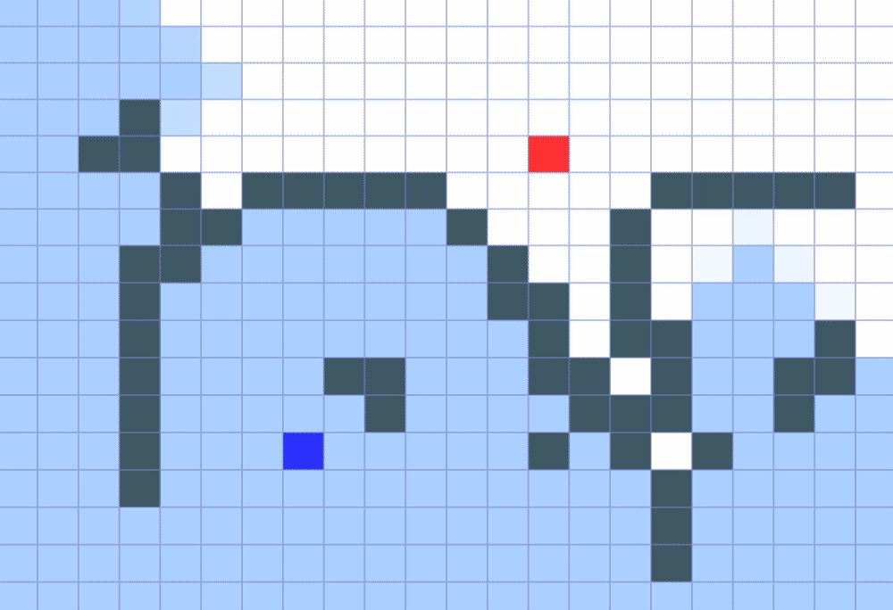

# Path finding

Visualization of path finding algorithms.

    

## Usage

- run all tests `npm test`
- build & serve the app in development mode `npm start`
- run optimized build for production `npm build`
- deploy the app to your gh-pages branch `npm run deploy`

## Cool stuff on graphs
- [Grids and Graphs](https://www.redblobgames.com/pathfinding/grids/graphs.html)
- [Amit on Pathfinding and A*](http://theory.stanford.edu/~amitp/GameProgramming/)
- [A Stranger to Words](http://astrangertowords.com/)
- [Dependency graphs](https://anvaka.github.io/pm/#/?_k=qupjwr)
- [All pages lead to philosophy](https://www.xefer.com/wikipedia)
- [Visualize text as a network](https://textexture.com/)
- [Internet map](https://internet-map.net/)
- [City road network](https://anvaka.github.io/city-roads)

## Credits

Icons made by <a href="https://www.flaticon.com/authors/becris" title="Becris">Becris</a> from <a href="https://www.flaticon.com/" title="Flaticon"> www.flaticon.com</a>
